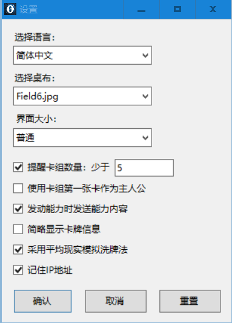

# 操作说明及快捷键

## 常规操作

1. 回合开始（菜单栏"动作"/主界面按钮/Ctrl+Q）：宣言回合开始，并将战场上所有单位竖置，羁绊区所有卡回到左侧。
2. 抽卡（双击卡组/右击卡组弹出菜单/Ctrl+D；复数张为Ctrl+Alt+D）：抽1张卡，或者抽复数张卡。
3. 将某张卡移动到某处（右击卡片弹出菜单，选择移动的目标区域）：处理单位的出击、被击破、加入羁绊区、检索、回收等许多动作。或者将卡牌通过鼠标直接移动到对应区域也作相同处理（例如移动到退避区则相当于菜单选择移动到退避区）。
4. 要进入退避区的卡牌（右击卡片弹出菜单）：置于退避区。或者直接将卡牌拖至退避区。在按住CTRL的同时将卡牌拖入退避区则只将顶层卡牌置入退避区。
5. 指定为攻击/能力的对象（右击卡片弹出菜单，选择"指定为对象"）：在攻击或发动能力之前，需要确定对象，方便对手确认。
6. 攻击（右击卡片弹出菜单）：宣言攻击。或者直接将进行攻击的卡牌拖动至攻击对象卡牌上也视作进行攻击宣言。
7. 发动能力/支援能力（右击卡片弹出菜单）：宣言发动能力，如果有复数个则需要选择。如果是支援区的卡，则显示"发动支援能力"。或者按住CTRL的同时将卡牌拖动至另一卡牌上也视为对其发动效果。
8. 羁绊卡右移（菜单栏"动作"/主界面按钮/Ctrl+E；复数为Ctrl+Alt+E）：在出击、升级/转职前需要确认场上的羁绊卡还足够进行该动作。每次出击、升级/转职前都要将对应数量的羁绊卡移到羁绊区的右侧。
9. 支援判定（菜单栏"动作"/主界面按钮/Ctrl+R）：在宣言攻击后，需要将卡组顶端的卡放置到支援区进行支援判定。在支援区有卡存在的情况下按"支援判定"，则那张卡进入退避区。
10. 宣言必杀攻击/神速回避（主界面按钮）：宣言使用必杀攻击或者神速回避，需要将手里对应的卡片放置到退避区。
11. 羁绊卡翻面（右击羁绊卡弹出菜单）：将羁绊卡翻面。
12. 横置/竖置（双击战场上的卡片/右击卡片弹出菜单）：将战场上的卡片横置或竖置。
13. 移动（右击卡片弹出菜单）：将战场上的卡片移动到另一个区域。
14. 进军（菜单栏"动作"）：需要将全部后卫单位移到前卫区时可以按下"进军"。
15. 补充卡组（双击空的卡组区/菜单栏"动作"→"卡组操作"）：卡组为空时，需要将退避区的卡全部放入卡组切洗。
16. 切换主人公（右击想要切换为主人公的卡牌弹出菜单）：设为主人公。当前主人公卡牌下会有明显的标记。
17. 设置/摘除指示物（右击想要设置指示物的卡牌弹出菜单）：设置/摘除指示物。设置指示物后在卡牌上会有明显标记。
18. 查看叠放卡（右击想要查看叠放卡的卡牌弹出菜单）：选择写有其Lv的选项后可以列表查看这叠卡牌。
19. 对于宝玉区的卡牌：右击菜单选择翻面则永久翻面（双方玩家都可以查看），选择查看则仅己方可以查看，任何操作都将使其复原。
20. 操作提示：拖动卡牌到相应区域进行操作时，拖动至一个恰当区域时左下角将提示会进行的操作，反之提示无操作。

## 查看卡片、区域信息

1. 查看卡组（右击卡组弹出菜单/菜单栏"动作"→"查看区域"）：查看卡组，对手将能够看到这个动作，因此请只在有必要的时候使用。关闭查看卡组的窗口时要选择是否切洗卡组。
2. 查看手牌（右击手牌区空白处弹出菜单/菜单栏"动作"→"查看区域"）：以列表的形式查看手牌，对手不会看到这个动作。
3. 查看自己或对手的退避区(双击退避区，右击退避区弹出菜单/菜单栏"动作"→"查看区域")：查看退避区的内容，对手不会看到这个动作。
4. 查看羁绊区(双击羁绊区，右击羁绊区弹出菜单/菜单栏"动作"→"查看区域")：以列表的形式查看羁绊区的内容，对手不会看到这个动作。

## 设置选项
1. 选择语言：有中文，英文，意大利语三种语言供选择。请选择适合自己的语言进行游戏。
2. 选择桌布：游戏桌布可自行选择。
3. 界面大小：可以选择适合自己的界面大小进行游戏。
4. 提醒卡组数量：可自行输入数字，当卡组内卡牌少于该数值时卡背将显示为红色。
5. 使用卡组第一张卡作为主人公：若勾选，则开始游戏时默认使用卡组第一张卡牌作为主人公。
6. 发动能力时发送能力内容：若勾选，在卡牌发动能力时将在对话框中发送发动的能力具体内容。
7. 简略显示卡牌信息：若勾选，将光标放在卡牌上时，左侧显示的信息将简化。
8. 记住IP地址：若勾选，则游戏将会记住您的IP地址。

## 其他常用操作

1. 展示卡组顶牌（右击卡组弹出菜单）：将卡组顶牌的内容公开。
2. 展示手牌/全部手牌（右击手牌/手牌区空白处弹出菜单）：将手牌的一张或全部公开给对手。
3. 切洗卡组（右击卡组弹出菜单/菜单栏"动作"→"卡组操作"/Ctrl+F）：将卡组切洗。
4. 导出战报（菜单栏"游戏"→"战报"）：将战报以txt文本文档的格式导出。
5. 重新连接（菜单栏"游戏"→"网络连接"）：用于游戏中途网络连接断开时。请不要关闭程序，重新连接对手。

