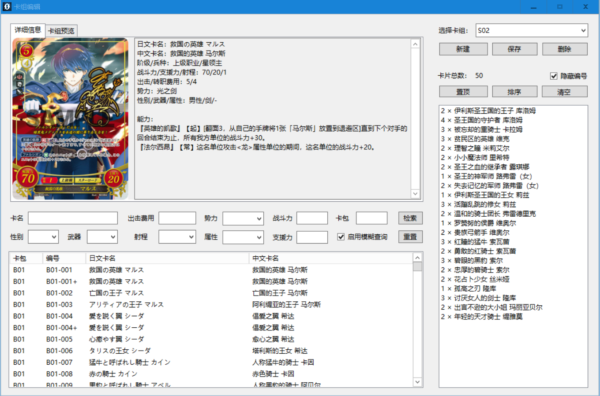
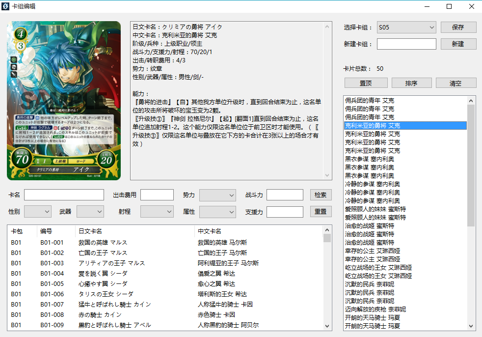

# 卡组编辑

1. 在"单机模式"下单击菜单栏"其他"→"编辑卡组"。
2. 选择已有的卡组，或者输入新卡组名称后按下"新建"。

   

3. 从左边的卡池列表中双击要加入的卡组的卡，从而完成卡组的构筑。
4. 可以利用检索模块来检索想要的卡片。
5. 想要修改卡组列表时，可以右键单击卡片，选择操作（双击卡片为删除）。
6. 卡组构筑完成后，推荐按下"排序"按钮以整理卡片顺序，再将卡组中的主人公卡（出击费用1）"置顶"。
7. 本程序已预置S01~S05五个预组卡组，可以直接进行测试。

   

