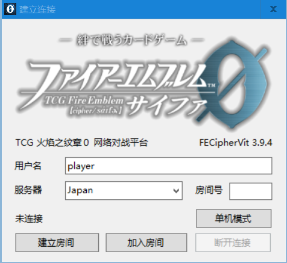
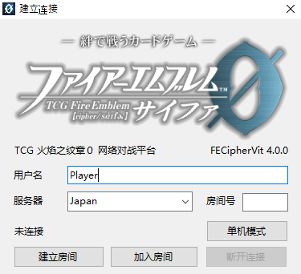

# 连接

您可以选择以下2种方案之一进行游戏连接。

**A．服务器中继（推荐）**

FECipherVit提供远程服务器供玩家进行中继连接。

IP地址：123.56.176.97（可能有变动，以此处为准）

1. 运行游戏主程序"FECipherVit.exe"，输入玩家的名称。
2. 由一名玩家先连接到服务器：输入服务器IP地址，在“连接”按钮上单击右键，点击“查找空闲端口”，若网络连接正常，则端口号会被自动填充。那之后单击“连接”即可连接到中继主机。

   

3. 另一名玩家随后输入服务器IP地址，将上述自动填充的端口号填入框内，点击“连接”，即可完成连接。
4. 若游戏中途连接断开，则可以按下菜单栏“游戏”→“网络连接”来再次呼出这个界面，重新进行连接。请不要直接关闭程序，否则场面不能恢复。
5. 您可以观看别的玩家之间的对战。在对战双方建立连接后，输入服务器IP地址，同时向玩家询问他们使用的端口号。输入后单击“连接”即可参与观战。
6. 如无法正常连接，请联系作者：sdercolin@outlook.jp （或其他你知道的联系方式）。

**B．玩家间直连**

1. 请确保至少有一方玩家拥有广域网IP地址（不能使用路由器）。否则，您可以使用局域网虚拟软件，如Hamachi。关于Hamachi的使用问题请查看：[Hamachi使用方法及常见问题](https://github.com/sdercolin/fecipher-vit-manual/tree/c48cbddbdb3034a2c18a1205b6a389dfd3af2fb4/fu-lu/hamachi.md)
2. 运行游戏主程序"FECipherVit.exe"，输入玩家的名称。一方先按下“等待连接”。请确保您的IP地址是广域网地址，并获得地址（百度搜索"ip"即可），告知对手。另一方输入IP地址后按下“连接”（端口号为空则默认为9050，若连接不上，请从对手处询问实际分配的端口号），则可以连接到对手。

   

3. 若游戏中途连接断开，则可以按下菜单栏“游戏”→“网络连接”来再次呼出这个界面，重新进行连接。请不要直接关闭程序，否则场面不能恢复。
4. 您可以观看别的玩家之间的对战。请确保您与他们处于同一个局域网内，在对战双方建立连接后，输入建立连接（等待连接）的玩家的IP地址，同时向该玩家询问当前空闲的端口号（进入游戏后再次从菜单栏呼出网络连接窗口，即可看到）。正常情况下（对战双方都是第一次打开程序并一次性连接成功，且您是第一个观战者）端口号为9051，此后递增。

