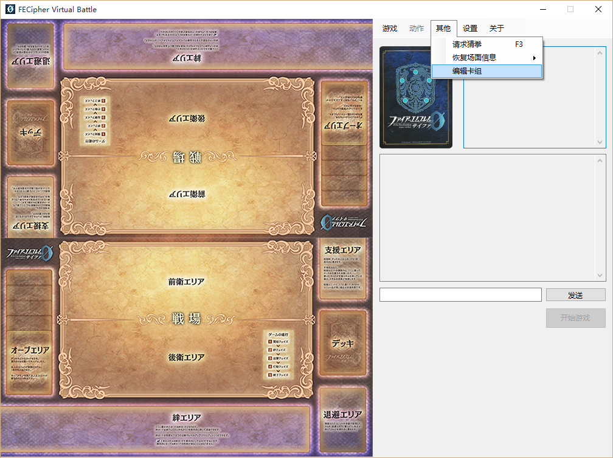
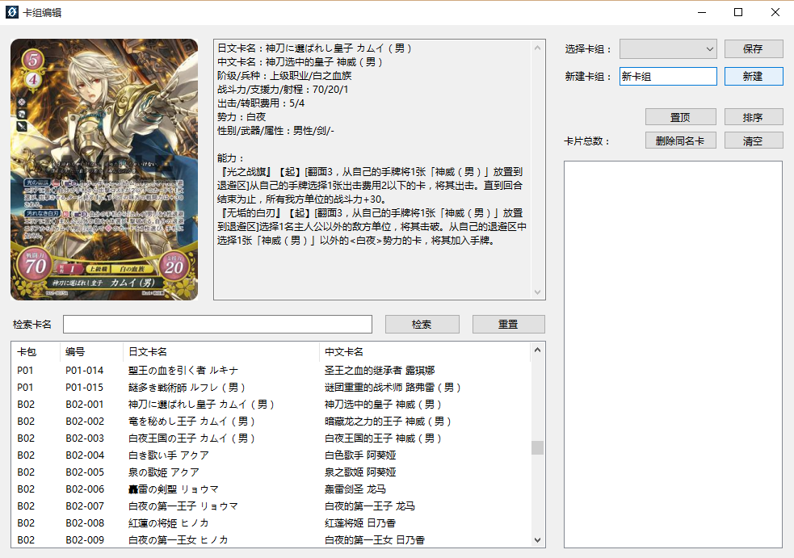
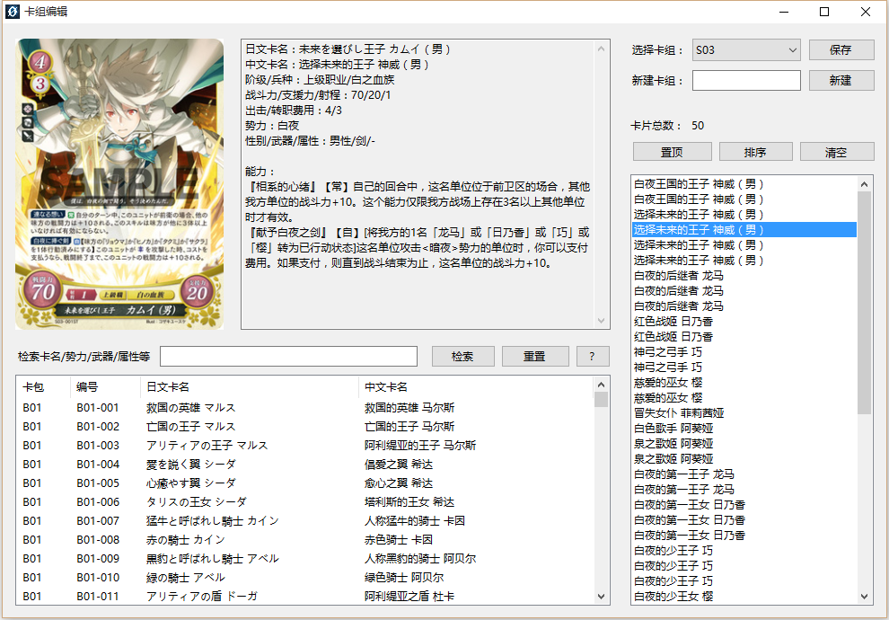

# 卡组编辑

1. 在"单机模式"下单击菜单栏"其他"→"编辑卡组"。

    
    
2. 选择已有的卡组，或者输入新卡组名称后按下"新建"。

    
    
3. 从左边的卡池列表中双击要加入的卡组的卡，从而完成卡组的构筑。

4. 在检索框中可以输入卡名的部分（中/日文均可）来检索想要的卡片。

5. 从卡组中删除卡片时，可以双击以删除一张卡，或者选中后按下"删除同名卡"。

6. 卡组构筑完成后，推荐按下"排序"按钮以整理卡片顺序，再将卡组中的主人公卡（出击费用1）"置顶"。

7. 本程序已预置第一弹的两个预组卡组，可以直接进行测试。

    
    

    
    