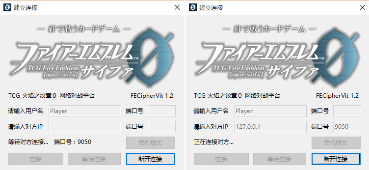

# 安装及连接

1. 本程序只能进行局域网连接，请首先设法和你的对手处于同一个局域网内。本程序推荐使用LogMeIn Hamachi，在本程序的数据包中包含Hamachi的安装包"hamachi.msi"，运行即可安装。关于Hamachi的使用问题请查看：

2. 运行游戏主程序"FECipherVit.exe"，输入玩家的名称。一方先按下"等待连接"，另一方输入对手的IPv4地址后按下"连接"（一般情况下端口号为空即可），则可以连接到对手。

    

 