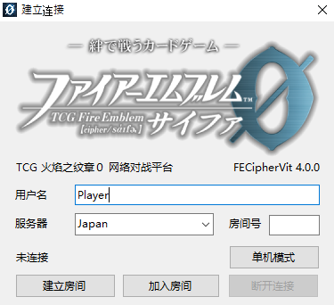

# 连接

1. 运行游戏主程序"FECipherVit.exe"，输入玩家的用户名。
2. 由一名玩家先连接到服务器：选定服务器后单击“创建房间”，若网络连接正常，进入游戏主界面，并在消息记录窗口中显示分配的房间号。

   

3. 另一名玩家随后输入创建房间的玩家所被分配的房间号，点击“加入房间”，即可完成连接。
4. 若游戏中途连接断开，则可以按下菜单栏“游戏”→“网络连接”来再次打开这个界面，重新进行连接。请不要直接关闭程序，否则场面不能恢复。
5. 您可以观看别的玩家之间的对战。在对战双方建立连接后，输入创建房间的玩家被分配的房间号。输入后单击“加入房间”即可参与观战。

